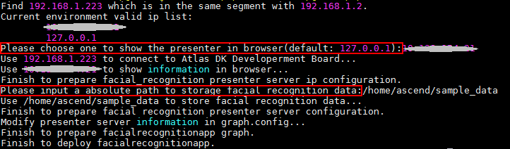

中文|[英文](README.md)

开发者可以将本Application部署至Atlas 200 DK上实现人脸注册、并通过摄像头对视频中的人脸信息进行预测，与已注册的人脸进行比对，预测出最可能的用户。

## 前提条件<a name="zh-cn_topic_0167217669_section137245294533"></a>

部署此Sample前，需要准备好以下环境：

-   已完成MindSpore Studio的安装。
-   已完成Atlas 200 DK开发者板与MindSpore Studio的连接，交叉编译器的安装，SD卡的制作及基本信息的配置等。

## 软件准备<a name="zh-cn_topic_0167217669_section8534138124114"></a>

运行此Sample前，需要按照此章节获取源码包，并进行相关的环境配置。

1.  获取源码包。

    将[https://github.com/Ascend/sample-facialrecognition](https://github.com/Ascend/sample-facialrecognition)仓中的代码以MindSpore Studio安装用户下载至MindSpore Studio所在Ubuntu服务器的任意目录，例如代码存放路径为：/home/ascend/sample-facialrecognition。

2.  以MindSpore Studio安装用户登录MindSpore Studio所在Ubuntu服务器，并设置环境变量DDK\_HOME。

    **vim \~/.bashrc**

    执行如下命令在最后一行添加DDK\_HOME及LD\_LIBRARY\_PATH的环境变量。

    **export DDK\_HOME=/home/XXX/tools/che/ddk/ddk**

    **export LD\_LIBRARY\_PATH=$DDK\_HOME/uihost/lib**

    > **说明：**   
    >-   XXX为MindSpore Studio安装用户，/home/XXX/tools为DDK默认安装路径。  
    >-   如果此环境变量已经添加，则此步骤可跳过。  

    输入:wq!保存退出。

    执行如下命令使环境变量生效。

    **source \~/.bashrc**


## 部署<a name="zh-cn_topic_0167217669_section147911829155918"></a>

1.  以MindSpore Studio安装用户进入facialrecognition应用代码所在根目录，如 **/home/ascend/sample-facialrecognition**。
2.  <a name="zh-cn_topic_0167217669_li08019112542"></a>执行部署脚本，进行工程环境准备，包括ascenddk公共库的编译与部署、网络模型的下载、Presenter Server服务器的配置等操作，其中Presenter Server用于接收Application发送过来的数据并通过浏览器进行结果展示。

    **bash deploy.sh** _host\_ip_ **internet**

    -   _host\_ip_：Atlas 200 DK开发者板的IP地址。


    命令示例：

    **bash deploy.sh 192.168.1.2 internet**

    -   当提示“Please choose one to show the presenter in browser\(default: 127.0.0.1\):“时，请输入在浏览器中访问Presenter Server服务所使用的IP地址（一般为访问MindSpore Studio的IP地址）。
    -   当提示“Please input a absolute path to storage facial recognition data:“时，请输入MindSpore Studio中存储人脸注册数据及解析数据，此路径MindSpore Studio用户需要有读写权限，如果此路径不存在，脚本会自动创建。

    如[图1](#zh-cn_topic_0167217669_fig184321447181017)所示，请在“Current environment valid ip list“中选择通过浏览器访问Presenter Server服务使用的IP地址，并输入存储人脸识别解析数据的路径。

    **图 1**  工程部署示意图<a name="zh-cn_topic_0167217669_fig184321447181017"></a>  
    

3.  启动Presenter Server。

    执行如下命令在后台启动Facial Recognition应用的Presenter Server主程序。

    **python3 presenterserver/presenter\_server.py --app facial\_recognition &**

    > **说明：**   
    >“presenter\_server.py“在当前目录的“presenterserver“目录下，可以在此目录下执行**python3 presenter\_server.py -h**或者**python3 presenter\_server.py --help**查看“presenter\_server.py“的使用方法。  

    如[图2](#zh-cn_topic_0167217669_fig69531305324)所示，表示presenter\_server的服务启动成功。

    **图 2**  Presenter Server进程启动<a name="zh-cn_topic_0167217669_fig69531305324"></a>  
    

    使用上图提示的URL登录Presenter Server，仅支持Chrome浏览器。IP地址为[2](#zh-cn_topic_0167217669_li08019112542)中输入的IP地址，端口号默为7009，如下图所示，表示Presenter Server启动成功。

    **图 3**  主页显示<a name="zh-cn_topic_0167217669_fig64391558352"></a>  
    

	**图 4** IP地址示例 <a name="zh-cn_topic_0167333823_fig64391558353"></a>  
    

    其中：
    - Atlas 200 DK开发者板使用的IP地址为192.168.1.2（USB方式连接）。
    - Presenter Server与Atlas 200 DK通信的IP地址为UI Host服务器中与Atlas 200 DK在同一网段的IP地址，例如：192.168.1.223。
    - 通过浏览器访问Presenter Server的IP地址本示例为：10.10.0.1，由于Presenter Server与MindSpore Studio部署在同一服务器，此IP地址也为通过浏览器访问MindSpre Studio的IP。


## 运行<a name="zh-cn_topic_0167217669_section1676879104"></a>

1.  运行Facial Recognition程序。

    在“sample-facialrecognition“目录下执行如下命令运行Facial Recognition应用程序。

    **bash run\_facialrecognitionapp.sh** _host\_ip_ _presenter\_view\_app\_name  camera\_channel\_name_   &

    -   _host\_ip_ :对于Atlas 200 DK开发者板，即为开发者板的IP地址。
    -   _presenter\_view\_app\_name_：用户自定义的在PresenterServer界面展示的App Name，此名称需要在Presenter Server展示界面保持唯一。
    -   _camera\_channel\_name_：摄像头所属Channel，取值为“Channel-1“或者“Channel-2“，查询摄像头所属Channel的方法请参考[Atlas 200 DK使用指南](https://ascend.huawei.com/documentation)中的“如何查询摄像头所属Channel”。

    命令示例：

    **bash run\_facialrecognitionapp.sh 192.168.1.2 video Channel-1 &**

2.  使用启动Presenter Server服务时提示的URL登录 Presenter Server 网站，仅支持Chrome浏览器。

    Presenter Server展示界面如[图4](#zh-cn_topic_0167217669_fig1189774382115)所示。

    **图 5**  Presenter Server界面<a name="zh-cn_topic_0167217669_fig1189774382115"></a>  
    

    > **说明：**   
    >-   Facial Recognition的Presenter Server最多支持2路Channel同时显示，每个 _presenter\_view\_app\_name_ 对应一路Channel。  
    >-   由于硬件的限制，每一路支持的最大帧率是20fps，受限于网络带宽的影响，帧率会自动适配较低的帧率进行显示。  

3.  进行人脸注册。
    1.  点击“Face Library“页签，在界面中输入“Username“。

        

    2.  单击“Browse“按钮，上传人脸图像，人脸图像裁剪时尽量按照“Example Photo“的比例设置。

    1.  点击Submit按钮上传若上传失败，可以更改裁剪比例。

4.  人脸识别以及比对。

    进入“App List“页签，在界面中点击对应的“App Name“，例如 _video_ ，若有人脸出现在摄像头中，且与已注册人脸匹配一致，则会出现对应人员姓名及相似度的标注。


## 后续处理<a name="zh-cn_topic_0167217669_section1092612277429"></a>

-   **停止人脸识别应用**

    Facial Recognition应用执行后会处于持续运行状态，若要停止Facial Recognition应用程序，可执行如下操作。

    以MindSpore Studio安装用户在“sample-facialrecognition“目录下执行如下命令：

    **bash stop\_facialrecognitionapp.sh** _host\_ip_

    _host\_ip_: 对于Atlas 200 DK开发者板，即为开发者板的IP地址。。

    命令示例：

    **bash stop\_facialrecognitionapp.sh 192.168.1.2**

-   **停止Presenter Server服务**

    Presenter Server服务启动后会一直处于运行状态，若想停止人脸识别应用对应的Presenter Server服务，可执行如下操作。

    以MindSpore Studio安装用户在MindSpore Studio所在服务器中执行如下命令查看人脸识别应用对应的Presenter Server服务的进程。

    **ps -ef | grep presenter | grep facial\_recognition**

    ```
    ascend@ascend-HP-ProDesk-600-G4-PCI-MT:~/sample-facialrecognition$ ps -ef | grep presenter | grep facial_recognition
    ascend 22294 20313 22 14:45 pts/24?? 00:00:01 python3 presenterserver/presenter_server.py --app facial_recognition
    ```

    如上所示 _22294_ 即为人脸识别应用对应的Presenter Server服务的进程ID。

    若想停止此服务，执行如下命令：

    **kill -9** _22294_

